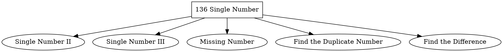

```dot

digraph G {
    #label="Single Number类似题目"
    #bgcolor="grey"

   # node[color="grey"]

    f1[label="136 Single Number", shape="box"]
    s1[label="Single Number II", shape="ellipse"]
    s2[label="Single Number III", shape="ellipse"]
    s3[label="Missing Number", shape="ellipse"]
    s4[label="Find the Duplicate Number", shape="ellipse"]
    s5[label="Find the Difference", shape="ellipse"]

    f1 -> s1 
    f1 -> s2
    f1 -> s3
    f1 -> s4
    f1 -> s5


    #{rank=same; f1}
    #{rank=same; s1,s2,s3,s4,s5}
}


```

